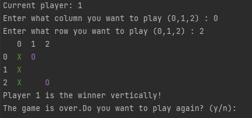

# Tic-Tac-Toe with Python

This project is a simple implementation of the Tic-Tac-Toe game using Python. The game is played on a 3x3 grid (also you can choose any grid you want), where players take turns placing their respective marks (either an X or an O) on the grid. The first player to get three of their marks in a horizontal, vertical, or diagonal row wins the game.

### Installing

To install the project, follow these steps:

1. Clone the repository to your local machine using `git clone https://github.com/ahmedjasarevic/TicTacToe---Python.git`.
2. Navigate to the project directory using `cd tictactoe-python`.
3. Run the `main.py` file using `python main.py`. This will start the game.

## Playing the game

To play the game, follow these steps:

1. The game will prompt you to choose whether grid you want. Enter your choice and press Enter.
2. The game will display the current state of the grid, with empty cells represented by a `.` character and show the current player that is playing.
3. The game will prompt you to enter the coordinates of the cell where you want to place your mark. The coordinates are represented by a number (1, 2, or 3) for the column and a number (1, 2, or 3) for the row. For example, entering "B2" will place your mark in the middle cell of the second column.
4. The game will update the grid and display the new state.
5. Repeat steps 3 and 4 until one of the players wins or the game ends in a draw.

## Win

You can win in 3 ways diagonally, horizontally and vertically.

Diagonal winner

Vertical winner

Horizontal winner

## Draw

## Built With

* [Python and PyCharm](https://www.python.org/) - The programming language used

